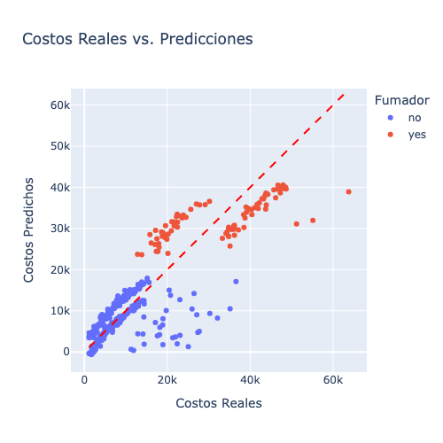

# EDA y ETL en GCP de Costos de Seguros de Salud en EE.UU. con PySpark y Pandas (Notebook + Dataproc)

## Descripción

Este proyecto analiza los costos de seguros de salud en EE.UU. utilizando **PySpark** y **Pandas** para el procesamiento de datos, **Plotly** y **Matplotlib** para la visualización, y **Scikit-Learn** para la construcción de un modelo predictivo.
Además, utiliza spark para la limpieza de los datos almacenados en **Google Cloud Storage** y guarda los datos limpios en formato .parquet.

## Estructura del proyecto

- `notebook/` → exploración y EDA con pandas / pandas-on-Spark
- `src/` → script PySpark para producción / Dataproc
- `data/` → datos de prueba
- `dataproc/` → scripts de creación de cluster y envío de jobs
- `test/` → tests unitarios del proyecto

## Pipeline de Dataproc

1. Leer datos desde GCS
2. Transformaciones pesadas en PySpark
3. Agregaciones y cálculos distribuidos
4. Guardar resultados en BigQuery

## Pasos del EDA

1. **Carga y limpieza de datos**: incluyó el tratamiento de valores duplicados y outliers, creación de columnas adicionales, y tranformación de variables categóricas a numéricas.
2. **Análisis exploratorio de datos (EDA)**: análisis estadísticos y de distribución de las variables y creación de gráficos dinámicos con Plotly.
3. **Modelado predictivo**: entrenamiento de un modelo de regresión para predecir costos de seguros de salud en función de distintas variables (edad, índice de masa corporal, número de hijos, etc.).
4. **Evaluación del modelo**: análisis del rendimiento del modelo con métricas como RMSE y R².

## Resultados del EDA

* Se identificaron patrones de costos con una influencia significativa de la condición de fumador, la edad y el índice de masa corporal.
* El modelo predictivo logró capturar tendencias en los costos con un desempeño satisfactorio, con un R² de 0.754.

## Visualización de Resultados

El siguiente gráfico muestra la comparación entre los costos reales y las predicciones, diferenciando entre fumadores y no fumadores:

Se observa que los fumadores tienden a tener costos más elevados, lo cual es capturado por el modelo.

## Dataset

El dataset utilizado proviene de Kaggle: [US Health Insurance Dataset](https://www.kaggle.com/datasets/teertha/ushealthinsurancedataset/data)
